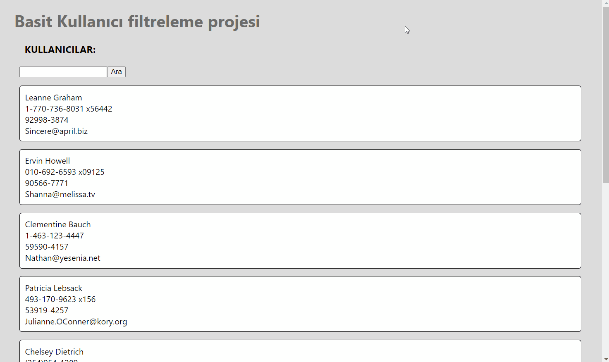

<h1> Filter User </h1>

<h2> Used Technologies </h2>

React

# Görevler
1- kullanıcı verileri olan linke istek at, 
2- isteği bileşen ekrana gelince bir kere bas, 
3- apiden gelen cevabı state e aktar, 
4- eğer users null ise loading yazdır, 
5- değilse state te tutulan kullanıcıları listele, 
6- inputun içerisindeki yazıyı butona basılınca al, 
7- yeni dizi oluştur, filtrelemeyi onda yap yenisini ekrana bas, 
8- aratılan isimdeki kullanıcıları filtrele, 
9- filtrelenen kullanıcıları ekrana bas, 
10- hem kullanıcı isimlerini hem aratılanları küçük harfe çevir, 

<h2> Screen Gif </h2>

# filterUser-react
